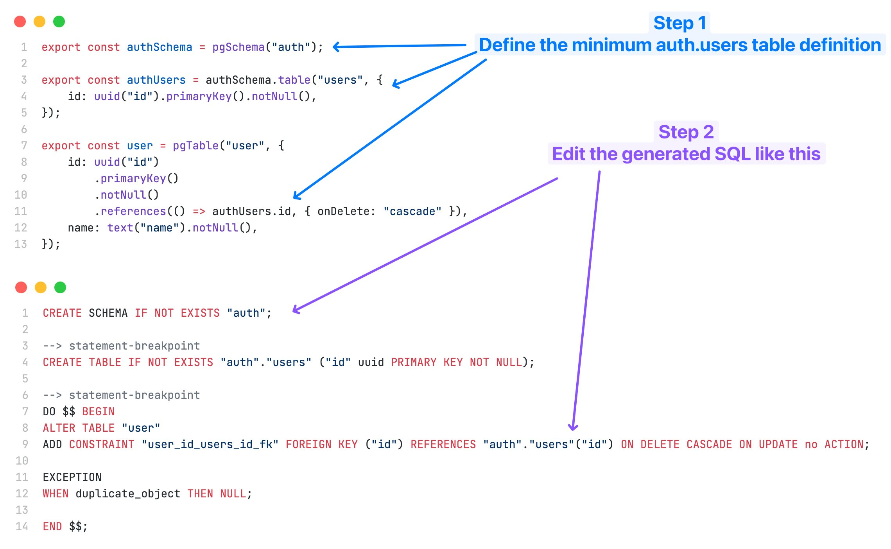

### About


Discover endless color possibilities with PickPalette – effortlessly generate palettes from images, explore diverse schemes, and soon, manage them on a dynamic dashboard. Elevate your design process with our upcoming AI suggestions and visualization tools.

- Frontend Code -> https://github.com/ArnabChatterjee20k/PickPalette-PaletteFromImage

- Live Link -> https://www.producthunt.com/posts/pickpalette

# Backend built with Supabase Edge functions

> 📘 Notes
>
> - Every code getting consumed by the functions must be present in the supabase/functions/ directory
> - Enable the deno workspace for getting a great dev experience

### How to setup deno for the vscode workspace?

- Deno cli must be installed first
- Then install the deno offical vscode extension
- Then enable by typing deno: on the command palette(ctrl+p)

### How the type flow is in sync with the db after a new migration is applied

- Supabase provide us generating types and we can use command

```bash
# for local dev
npm run gen-types-local

# for remote db
npm run gen-types-remote
```
- We are using drizzle for maintaining a central schema and supabase db API for working with the db
- Deno does not support drizzle properly. The drizzle kit(used for migrations) is giving error.
  - Supabase edge functions run in deno environment so we cant use models for working with the db.
  - But we need a centralised schema as well.
  - So the following pattern is used for keeping both in sync
- The migration is getting maintained using drizzle orm so that later if required we can move our project to server based api like with express or other frameworks we can use the schemas
- Here the schema models are getting used for generating the schema.
- Then migration is getting done. Then the types are generated so that we can use the schema typings in Deno environment of the supabase functions
- Then we can start consuming the types generated even with the supabase client in the deno env
### Running Migrations using Drizzle Kit in Supabase Table

```bash
npm run generate
```

```bash
# for migrating the local db
npm run migrate-local
```

```bash
# for migrating the remote db
npm run migrate-remote
```

- Then follow this
  

- We need to follow this for referencing the auth table
- Auth table is generated automatically by supabase
- We can write all the properties manually in the model but we need to reference that in other tables
- So we can bare minimum schema auth and then inside it a table with a bare minimum fields we require for reference in other table
- Now after the generate command, a sql file will be generated but if we run that we will get error as the auth schema is alread present
- So change this

```
CREATE SCHEMA "auth";
```

To this

```
CREATE SCHEMA IF NOT EXISTS "auth";
```

### reseting the db

```
sudo npx supabase db reset
```

# Scraping Pipeline

### How to start the scraper

```
    npm run start:db
```

```
    npm run start:scraper
```
